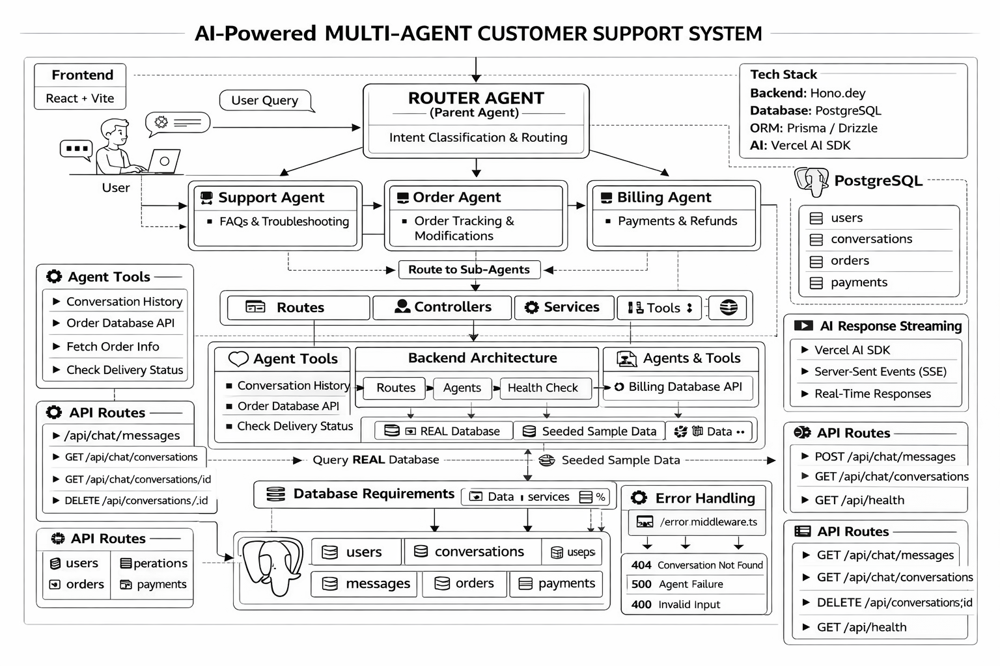

# 🧠 Support-Agent  
### Multi-Agent AI Support System with LLM Routing, Tool Calling & Contextual Memory

A production-style **agentic AI backend** demonstrating **LLM-based routing**, **specialized sub-agents**, **database-backed tool calling**, and **conversation memory**, built as part of an **Applied AI / Research Internship assessment**.

- **Frontend (Vercel):** https://support-agent-web.vercel.app  
- **Backend (Render):** https://support-agent-backend.onrender.com  

---

## 📌 Project Summary

This project implements a **multi-agent AI support system** capable of handling real-world customer support scenarios such as:

- General support & FAQs
- Order tracking and delivery queries
- Billing, payments, refunds, and invoices

Instead of brittle keyword matching, the system uses a **main LLM router agent** that intelligently decides **which sub-agent should handle a query**, and each sub-agent can **call tools that query real database data**.

All conversations are **persisted**, **context-aware**, and **user-scoped**.

---

## ✨ Core Features

### ✅ Agentic AI Architecture
- LLM-based **Router Agent**
- Specialized **Support, Order, and Billing agents**
- Tool-first agents for order and billing queries (no hallucination)
- LLM-based support agent for general and ambiguous queries
- Deterministic agent handoff with explicit unsupported-intent handling

### ✅ Contextual Conversations
- Conversation memory stored in DB
- Resolves references like *“it”*, *“that order”*, *“as I said before”*
- Session-based conversations (new session per browser / restart)

### ✅ Real Database Tools
- Prisma + PostgreSQL
- Orders, payments, conversations seeded with real data
- Agents query DB via tools (no hallucination)

### ✅ REST API + Frontend Demo
- Clean REST endpoints
- React frontend for easy testing
- No authentication complexity (as per assessment scope)

---

## 🧠 Agent Architecture



### 🔹 Main Router Agent (LLM-Based)
- Reads:
  - User message
  - Recent conversation history
- Decides:
  - Which sub-agent should handle the request
- Can redirect back to support if query goes out of scope

### 🔹 Sub-Agents (All Implemented)

#### 1️⃣ Support Agent
**Responsibilities**
- General support
- Clarifications
- FAQs
- Context resolution
- Handles ambiguous queries and asks clarifying questions

**Tools**
- Query conversation history
- LLM-based responses (streaming enabled)

---

#### 2️⃣ Order Agent
**Responsibilities**
- Order status
- Shipment & delivery
- Order follow-ups

**Tools**
- Fetch latest order by user (database-backed)

**Design**
- Tool-first, deterministic agent
- Does not use LLMs to avoid hallucination

---

#### 3️⃣ Billing Agent
**Responsibilities**
- Payment status
- Refund status
- Invoice queries

**Tools**
- Fetch payment and refund status from database

**Design**
- Tool-first, deterministic agent
- Returns factual responses only (no advice or speculation)

## 🛡️ Safety & Hallucination Control

- Order and Billing agents are strictly tool-driven and never rely on LLM-generated text
- Unsupported intents such as order cancellation or returns are explicitly rejected
- LLM usage is limited to the Support agent to prevent incorrect or speculative responses
- This design mirrors production-grade AI systems where factual domains are protected from hallucination

---

## 🧰 Tech Stack

### Backend
- Node.js
- Hono (lightweight web framework)
- Prisma ORM
- PostgreSQL
- Vercel AI SDK
- Groq LLM (LLaMA-3.1-8B-Instant)

### Frontend
- React
- Vite
- HTML / CSS

### Tooling & Utilities
- TypeScript
- tsx
- Vitest
- Prisma Studio
- CSV-based data seeding

---

## 🗃️ Database Design (Prisma)

Entities:
- `User`
- `Conversation`
- `Message`
- `Order`
- `Payment`

All messages and agent replies are stored to support:
- Conversation replay
- Contextual reasoning
- RBAC via `userId`

---

## 🌐 API Endpoints

### Health
GET /api/health
---
### Chat
POST /api/chat/messages # Send a message
GET /api/chat/conversations?userId=1
GET /api/chat/conversations/:id
DELETE /api/chat/conversations/:id?userId=1
---
### Agents
GET /api/agents
GET /api/agents/:type/capabilities

---

## 📁 Project Structure

support-agent/
├── apps/
│   ├── backend/                 # Hono + Agents + Prisma
│   │   ├── prisma/
│   │   ├── src/
│   │   │   ├── agents/
│   │   │   ├── tools/
│   │   │   ├── services/
│   │   │   ├── controllers/
│   │   │   ├── routes/
│   │   │   ├── middlewares/
│   │   │   ├── db/
│   │   │   └── app.ts
│   │   ├── .env
│   │   └── package.json
│   │
│   └── web/                     # React + Vite frontend
│       ├── src/
│       ├── index.html
│       └── package.json
│
├── packages/
      └── api/                   # Shared API contracts (Hono RPC)
│
├── turbo.json
├── package.json                 # Root workspace config
└── README.md

### Packages
- `packages/api` → Shared API contracts and domain types used by backend and frontend
- Enables end-to-end type safety via Hono RPC

---

## 🧩 Monorepo Architecture (Turborepo)

This project is structured as a **Turborepo monorepo** to support:

- Clear separation of frontend and backend apps
- Shared packages (types, API contracts) without duplication
- Scalable architecture for future expansion (Hono RPC)

### Apps
- `apps/backend` → Hono-based AI backend
- `apps/web` → React + Vite frontend

### Packages
- `packages/` → Reserved for shared types and API contracts (introduced in later phases)

All applications are orchestrated using Turborepo for unified development and build workflows.

---

## 🔐 End-to-End Type Safety (Hono RPC)

- Introduced Hono RPC for non-streaming APIs
- Backend defines API contracts once using Zod schemas
- Frontend consumes fully typed interfaces from `packages/api`
- Streaming chat remains REST-based due to streaming constraints

---

## 🔧 Environment Variables

### Backend (`apps/backend/.env`)

```env
DATABASE_URL="postgresql://postgres@localhost:5432/support_agent"
GROQ_API_KEY=your_groq_api_key_here
PRISMA_CLIENT_ENGINE_TYPE=binary
PRISMA_CLI_QUERY_ENGINE_TYPE=binary
```  

NOTE - Authentication is intentionally omitted to keep focus on agent logic (as per assessment).

---

# ▶️ Running the Project (Monorepo Setup)

This project uses a Turborepo monorepo, so both the backend and frontend are managed and run from the repository root.

## 1️⃣ Clone Repository
git clone https://github.com/Anugrah0619/Support-agent.git
cd Support-agent

## 2️⃣ Install Dependencies (Root)
npm install

This installs dependencies for:
Backend (apps/backend)
Frontend (apps/web)
Workspace tooling

## 3️⃣ Configure Backend Environment

Create the environment file: apps/backend/.env

DATABASE_URL="postgresql://postgres@localhost:5432/support_agent"
GROQ_API_KEY=your_groq_api_key_here
PRISMA_CLIENT_ENGINE_TYPE=binary
PRISMA_CLI_QUERY_ENGINE_TYPE=binary

Environment variables are explicitly loaded at runtime to support Node ESM and monorepo execution.

## 4️⃣ Setup Database (Prisma)
cd apps/backend
npx prisma generate
npx prisma migrate dev --name init
npx prisma studio (Optional)

## 5️⃣ Seed Database with Sample Data
npx tsx scripts/seedFromCsv.ts

## 6️⃣ Start Full System (Backend + Frontend)

Return to the repository root:
cd ../../
npm run dev

This command:
Starts the backend on http://localhost:3000
Starts the frontend on http://localhost:5173
Uses Turborepo to orchestrate both applications

## 7️⃣ Access the Application

Frontend UI: http://localhost:5173
Backend Health Check: http://localhost:3000/api/health

✅ Notes

Backend and frontend are not run separately
Turborepo ensures consistent dev and build workflows
Authentication is intentionally omitted to focus on agent logic (as per assessment scope)
---

# 🧪 How to Test (Recommended Order)

## 1️⃣ Basic Support

Hi
Can you help me?

---

## 2️⃣ Order Flow

Where is my order?
Is it shipped?
When will it be delivered?

---

## 3️⃣ Billing Flow

What is my payment status?
Do I have any refund?

---

## 4️⃣ Agent Switching (Key Test)

Where is my order?
What is my payment status?
Is it shipped?

---

## 5️⃣ Context Resolution

Is it shipped?
When will it be delivered?

---

# 🧪 Testing Strategy

This project follows a layered testing approach:

- **Unit Tests**
  - Router agent intent classification
  - Deterministic routing behavior
- **Integration Tests**
  - Database-backed Order and Billing tools
  - Foreign-key–safe setup and teardown
- **End-to-End Test**
  - Full chat flow from API request to persisted response

All tests are deterministic, isolated, and CI-ready.

---

# 🧠 Design Decisions

- LLM-based routing avoids brittle keyword-based logic  
- Sub-agents remain focused, modular, and independently testable  
- Tools guarantee factual, database-backed responses  
- Conversation memory enables real multi-turn conversational behavior  
- RBAC enforced using `userId` without introducing authentication complexity  
- Architecture closely mirrors real-world agentic AI systems used in production  
- Streaming responses are enabled only for the Support agent
- Order and Billing agents return atomic, non-streaming responses for consistency and correctness

---

---

## 🌍 Production Deployment

This project is deployed in a production-style environment using modern cloud platforms.

### Live URLs
- **Frontend (Vercel):** https://support-agent-web.vercel.app  
- **Backend (Render):** https://support-agent-backend.onrender.com  
- **Health Check:** `GET /api/health`

### Deployment Stack
- **Frontend:** Vercel (Vite + React)
- **Backend:** Render (Node.js + Hono, streaming enabled)
- **Database:** Railway PostgreSQL
- **LLM Provider:** Groq (LLaMA-3.1-8B-Instant)

### Environment Variables

**Backend (Render)**
```env
DATABASE_URL=...
GROQ_API_KEY=...
```  

Frontend (Vercel)
```env
VITE_API_BASE_URL=https://support-agent-backend.onrender.com
Vite environment variables are injected at build time and require redeployment when changed.
```  

Notes
1. Streaming responses are enabled for the Support Agent
2. CORS preflight and rate-limiting are handled explicitly
3. Authentication is intentionally omitted to focus on agentic AI design

---

## 🚀 Future Scope

- **RAG-based Semantic Search:**  
  Integrate Retrieval-Augmented Generation (RAG) to enable semantic search over FAQs, documentation, and historical support data using vector databases.

- **Hybrid Agent Routing:**  
  Extend the router agent to dynamically choose between database tools, RAG retrieval, and pure LLM reasoning based on query type.

- **Improved Context Optimization:**  
  Apply semantic summarization and context compaction to support longer conversations with reduced token usage.

- **Workflow & Automation:**  
  Add workflow orchestration for actions like ticket creation, escalations, and human handoff.

- **Observability & Feedback:**  
  Incorporate user feedback and tracing to continuously improve agent accuracy and routing decisions.
